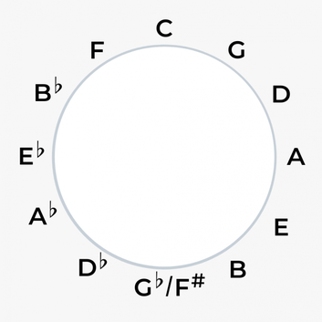

# Chord Constructor 
This package started out of need. 

When I was writting a Web App which suggested
random chords to play, I found myself in need of a really big list of chords

I wanted every chord I could think of, and since I coulnd't find anything that
delivered them in JSON, I got to work 

## What it does
This packages exports a function: `getChords(chordType)`, which returns all 
chords in the circle of fifths of a certain type, with the inclusion of F#/Gb. 



**AKA:** all chords between 0 & 6 alterations, both sharps and flats

Chords are output in JSON as follows: 

`chord = {[notes], name, symbol}`

**For example** 

C major chord: 
 
 ```
{
     notes: ['C', 'E', 'G'],
     name: 'C major',
     symbol: 'C'
}
 ```

## Arguments

`getChords(chordType, amount, rootName, options)`

+ **chordType:** String. The types of chords can be found in `constants.js`. I only made so many, but feel free to expand. The current full list is: 

<<<<<<< HEAD
>- major
>- minor
>- major seventh
=======
## Arguments
>>>>>>> 634a7e253f6c1842b21e27c3094766c41e47f051

+ **amount:** Number. The amount of alterations that you want to iterate through. Default is `amount = 6`:

>6 * 2 (flats & sharps) + root = 13 chords

+ **rootName:** String. The name of the note where you want to start the iteration. Defaults to `'C'`

> Can be any note as long as it only has **one** alteration
>
> rootNote = 'Eb' // :heavy_check_mark: |  rootNote = 'Ebb' // :x:

+ **opts:** Object. Has properties `getFlats` & `getSharps` which default to `true`. If you want to ignore any or both, just set them to false. Say you only want the chords with sharps (G, D, A, E, B, F#): 
```
    opts: {
        getFlats: false,
        getSharps: true,
    }
```
## Usage
Example with commonJS `require`
1. Install with npm:  `npm i chord-constructor`
2. Import package 
3. Call `getChords`

```
const chordConstructor = require('chord-constructor')
const minorChords = chordConstructor.getChords('minor')
```

